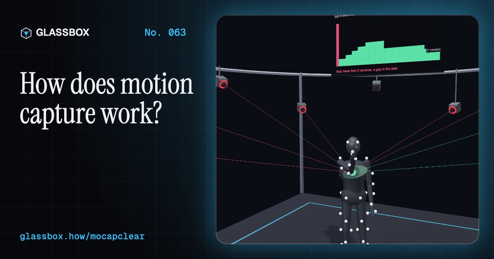
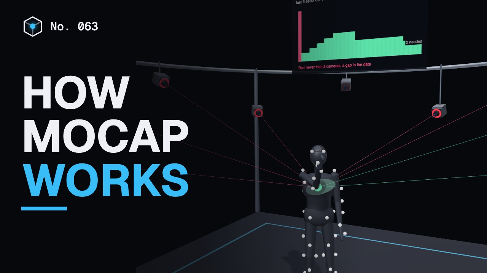
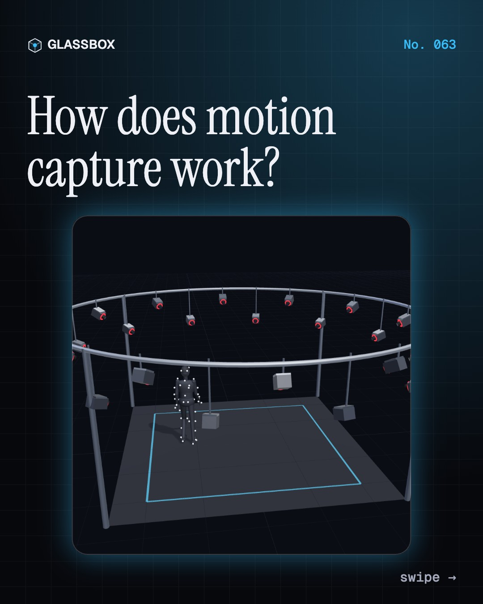
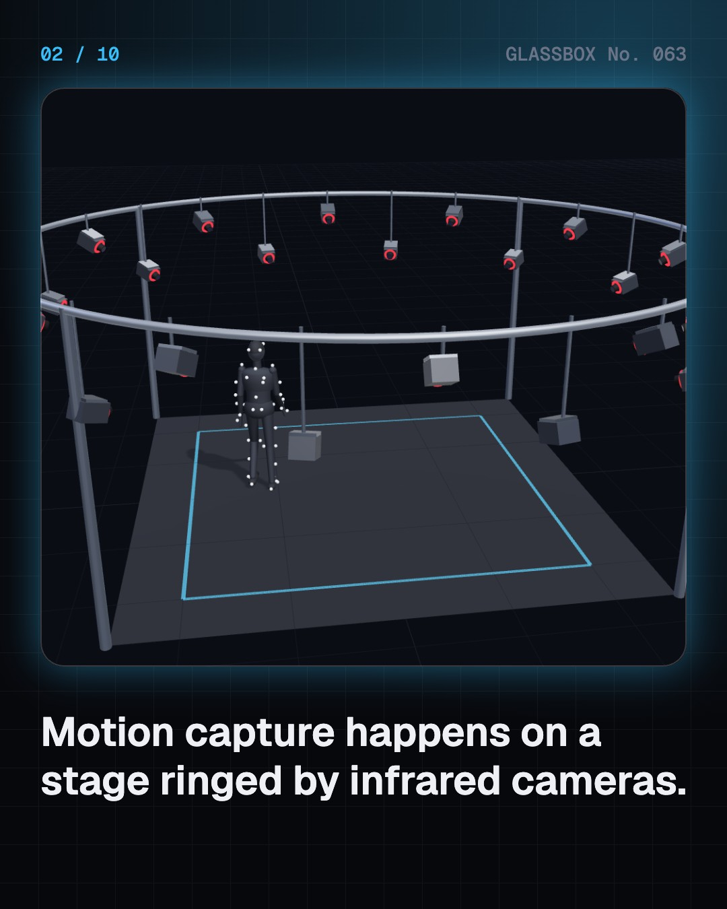
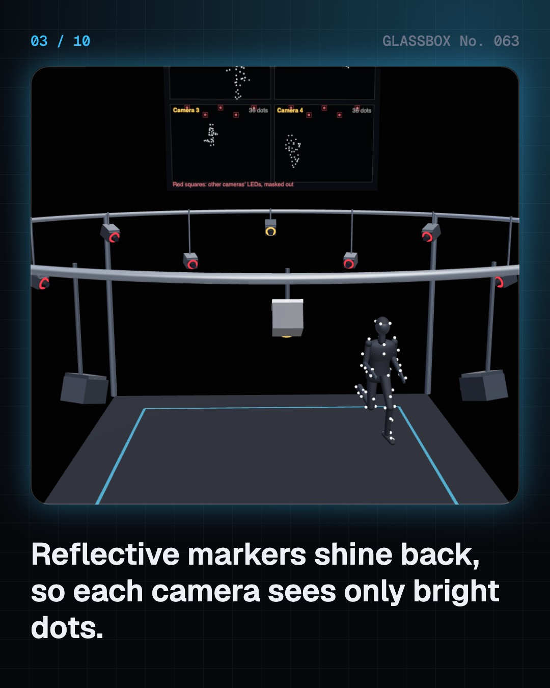
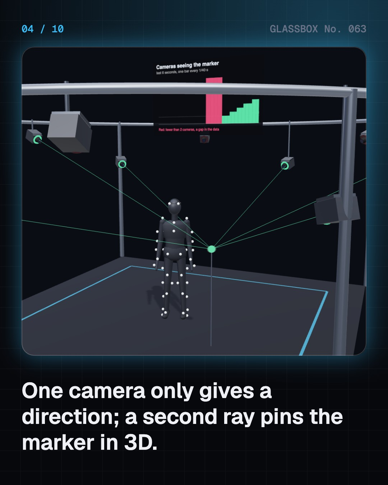

<!-- glassbox:start -->
<!-- Generated from glassbox.json by the Glassbox hub (npm run readme -- mocapclear). Edit glassbox.json, not this block. -->
<p align="center"><a href="https://glassbox.how/e/mocapclear/"></a></p>

<h1 align="center">MocapClear</h1>

<p align="center"><b>How does motion capture work?</b><br>A mocap camera never sees the actor, only bright dots on black. Walk a faceless performer through a ring of infrared cameras, cross the rays that pin each marker to a fraction of a millimetre, hand the motion to a four-armed creature, solve a face from helmet-camera dots, and watch an inertial suit drift away.</p>

<p align="center"><a href="https://glassbox.how/mocapclear/"><b>▶ Play with it</b></a> &nbsp;·&nbsp; <a href="https://glassbox.how/e/mocapclear/">Read the 60-second explainer</a> &nbsp;·&nbsp; <a href="https://glassbox.how/mocapclear/glassbox/reel.mp4">Watch the 40-second video</a></p>

<p align="center">
  <a href="https://glassbox.how/e/mocapclear/"></a>
  <a href="https://glassbox.how/e/mocapclear/"></a>
  <a href="LICENSE"></a>
  <a href="LICENSE-CONTENT.md"></a>
  <a href="#privacy"></a>
</p>

## In 60 seconds

1. **The capture volume.** Optical mocap happens on a stage ringed by 12 to 48 infrared cameras. The performer wears 40 to 60 markers covered in retroreflective tape, which bounce the cameras' infrared light straight back. Each camera sees only bright dots on black and sends their 2D centres, about 120 times a second.
2. **Where rays meet.** One camera only gives a direction to a dot: a ray. Two or more rays from different angles cross at the marker's 3D position. Centres found to a fraction of a pixel place a still marker to well under a millimetre (0.15 mm in one lab test). When an arm hides a marker from all but one camera, there is a gap.
3. **Dots to a creature.** Software names every dot (labelling), fits a skeleton inside them (solving), then copies the joint rotations onto a creature (retargeting). If the creature's legs are longer but its body travels the actor's distance, its planted feet slide. Scaling the travel or locking the feet fixes it.
4. **Faces and fingers.** A head-mounted camera watches dots on the face. A facial solver finds the mix of blend shapes (jaw open, smile, brows up) that explains how the dots moved, and those weights drive the creature's face, even remapped to ears. Gloves with bend sensors capture fingers.
5. **Other ways to capture.** Inertial suits use about 17 motion sensors and work anywhere, but position comes from adding up acceleration twice, so it drifts unless planted feet reset it. Markerless systems find body keypoints in ordinary video with machine learning, and phones capture faces with 30,000 infrared dots.
6. **On set and cleanup.** In performance capture, a tracked virtual camera shows the director the creature live in its world. Afterwards, gaps are filled with smooth curves and jitter is filtered out, but heavy smoothing flattens real motion. Animators then polish, for films shot by shot and for games as loops.

## Words worth knowing

| Term | Meaning |
|---|---|
| **Motion capture** | Recording a real performer's movement so a digital character can move the same way. |
| **Retroreflective marker** | A small ball with tape that bounces light straight back to the camera that lit it. |
| **Triangulation** | Finding a point in 3D from where rays from two or more cameras cross. |
| **Occlusion** | When a body part or object hides a marker from a camera. |
| **Solving** | Fitting a skeleton inside the labelled markers to get joint rotations. |
| **Retargeting** | Copying motion from one skeleton onto a body with different proportions. |
| **Blend shape** | A saved face expression mixed in by a weight from 0 to 1. |
| **IMU** | A tiny gyroscope, accelerometer and compass that measures how a body part moves. |
| **Performance capture** | Capturing body, face and voice together so the whole acting performance is kept. |

## A short history

**From a galloping horse and a man in a striped suit to creatures that act live on set: 150 years of turning movement into numbers.**

- **1878** · A galloping horse, frozen in 12 photos (Eadweard Muybridge, for Leland Stanford, Palo Alto, California, USA)
- **1883** · The first marker suit (Étienne-Jules Marey, Paris, France)
- **1915** · The rotoscope (Max Fleischer, with his brother Dave, New York, USA)
- **1973** · A person made of 10 to 12 lights (Gunnar Johansson, Uppsala, Sweden)
- **1983** · The Graphical Marionette (Carol Ginsberg and Delle Maxwell, MIT, Cambridge, Massachusetts, USA)
- **2000** · A whole film made with mocap, animated in Chennai (Pentafour Software (later Pentamedia Graphics), Chennai (then Madras), India, and Los Angeles, USA)
- **2002** · Gollum and Andy Serkis (Andy Serkis and Weta Digital, Wellington, New Zealand)
- **2004** · A whole film shot on a capture stage (Robert Zemeckis, Sony Pictures Imageworks and Vicon, Culver City, California, USA)

The full story, with 27 moments, charts, people and 36 sources: [glassbox.how/e/mocapclear/history](https://glassbox.how/e/mocapclear/history/). The data lives in [`history.json`](history.json).

## Video and slides

Made with the Glassbox studio from this box's storyboard (`window.glassbox.director`). Free to reuse under CC BY 4.0.

<a href="https://glassbox.how/mocapclear/glassbox/video.mp4"></a>

<p><a href="glassbox/slide-1.jpg"></a> <a href="glassbox/slide-2.jpg"></a> <a href="glassbox/slide-3.jpg"></a> <a href="glassbox/slide-4.jpg"></a></p>

| File | What | Size |
|---|---|---|
| [`glassbox/reel.mp4`](https://glassbox.how/mocapclear/glassbox/reel.mp4) | Reel / Short, with captions and soundtrack | 1080×1920 |
| [`glassbox/video.mp4`](https://glassbox.how/mocapclear/glassbox/video.mp4) | YouTube video, with captions and soundtrack | 1920×1080 |
| `glassbox/slide-1…10.jpg` | Instagram carousel | 1080×1350 |
| `glassbox/thumb.jpg` | YouTube thumbnail | 1280×720 |
| `glassbox/cover.jpg` | Share card and repo social preview | 1200×630 |
| [`glassbox/history-reel.mp4`](https://glassbox.how/mocapclear/glassbox/history-reel.mp4) | “History in 10 moments” Reel / Short | 1080×1920 |
| `glassbox/history-slide-*.jpg` | History carousel | 1080×1350 |
| `glassbox/post.json` | Post copy and schedule used by the publish kit | |

## Privacy

This box has no accounts and no ads, and it ships its own fonts and libraries. When you run it yourself it sends nothing anywhere. On glassbox.how, the site's `/bar.js` also loads Glassbox's analytics: **Google Analytics** to count visits (it asks first in the EU, UK and Switzerland, and stays off when your browser sends Global Privacy Control or Do Not Track) and **ClickTrust** to detect bots.

It remembers a few things **in your own browser only**, and never sends them anywhere:

| Browser storage key | What it holds |
|---|---|
| `mocapclear.v1` | Which chapters you have opened, your best quiz scores, and sound on or off. |

Exactly what each one sees is at [glassbox.how/privacy](https://glassbox.how/privacy/).

## Licences

- **Code:** [MIT](LICENSE). Use it, change it, ship it.
- **Explanations, text, images and videos** (`glassbox.json`, `glassbox/`): [CC BY 4.0](LICENSE-CONTENT.md). Credit “Glassbox, glassbox.how/e/mocapclear”.
- **Third-party parts** keep their own licences: [three.js](https://threejs.org) (MIT), [Geist, Instrument Serif](https://openfontlicense.org) (SIL OFL 1.1).
- The Glassbox name and logo aren't covered by either licence. See the [terms](https://glassbox.how/terms/).

Found a mistake? [Open an issue](https://github.com/bdeeps/mocapclear/issues). Corrections happen in public.
<!-- glassbox:end -->

## Run it

It's plain HTML, CSS and JavaScript. No build step and no dependencies. Run locally, it contacts no other website.

```bash
python3 -m http.server 8000
```

Three.js and the fonts ship in `vendor/` and `fonts/`, so it also works offline.

Then open http://localhost:8000.

## How it's built

| File | What |
|---|---|
| `index.html`, `css/app.css` | The page and its styles |
| `js/app.js`, `js/stage.js`, `js/ui.js`, `js/kit.js` | The shared Glassbox 3D engine: chapters, 3D stage, controls, quiz, video director |
| `js/chapters/*.js` | One file per chapter: the 3D model, controls, text, key terms, quiz and video scenes |
| `js/mocap.js` | Shared parts: the faceless mannequin and its 53-marker suit, the procedural walk, run and jump with planted feet, our creatures and retargeting, the infrared camera ring, marker visibility and triangulation maths, and chart boards |
| `glassbox.json` | Title, question, explainer beats, key terms, browser storage and credits shown on glassbox.how |
| `reel` in each chapter | The storyboard the Glassbox studio records into short videos |
| `glassbox/` | The published video, slides, thumbnail and post copy |
| `fonts/`, `vendor/three/` | Self-hosted Geist and Instrument Serif (SIL OFL 1.1) and three.js (MIT) |
